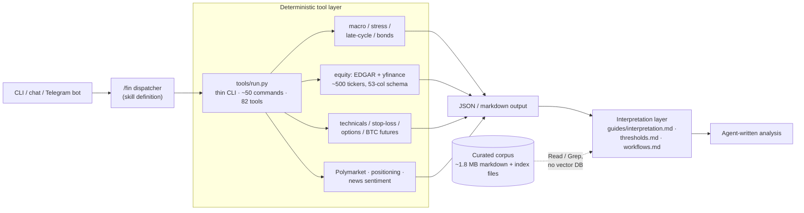

# Financial Agent

> Macro & financial-analysis agent where Claude Code itself is the runtime —
> no agent framework, no LLM SDK. A skill dispatcher routes ~50 analysis
> commands (macro regime, financial-stress scoring, late-cycle detection,
> stop-loss technicals, equity and options analysis) to a deterministic
> Python tool layer, then interprets results against a versioned rules corpus.

*Source: private repo (~29k LOC Python across 82 tools, plus ~33k lines of
markdown knowledge base). Architecture documented below; a public docs
edition is planned.*

---

## Problem

Most financial-analysis tasks are 80% look-up and computation, 20% judgment.
One-off scripts (`check_yield_curve.py`, `stress_index.py`, …) handle the
80% but rot fast, and a chat LLM handles the 20% but re-derives — or
hallucinates — the 80%. The split that works: deterministic Python computes
every number; the agent's job is routing, orchestration, and *interpretation*
against explicit, versioned rules. Nothing numeric is left to the model.

## Architecture



Three layers, strictly separated:

1. **Dispatcher** — a Claude Code skill maps `/fin <command>` to a thin
   Python CLI. Command groups: macro & regime (`macro`, `stress`,
   `latecycle`, `bonds`, `termpremium`, `vixanalysis`…), equity
   (`analyze`, `compare`, `peers`, plus Graham value screens), technicals
   (`ta`, `sr`, `breakout`, `sl <asset> <price> <dir>` for stop-loss
   placement and sizing), commodities, BTC futures, and multi-step chains
   (`full_report` runs an eight-analysis sequence ending in a synthesis).
2. **Deterministic tools** — plain Python doing all arithmetic: a
   financial-stress composite (8 components with a breadth floor), a
   13-signal late-cycle detector, 6-dimension regime classification,
   options-strategy scoring across 7 structures. Data comes from FRED
   (56 series with local-first routing), SEC EDGAR + Yahoo Finance
   (~500 tickers on a shared 53-column schema, source selected by
   financial-quarter freshness), exchange futures data, and Polymarket
   as a "what's already priced?" cross-check.
3. **Interpretation** — the agent reads the JSON and writes analysis
   against `interpretation.md` ("what does this number mean"),
   `thresholds.md`, and `workflows.md` ("how to chain tools"). The rules
   are markdown, versioned in git, and auditable — when an interpretation
   is wrong, the fix is a documented diff, not a prompt tweak lost to
   history.

A Telegram bot wraps the same agent headlessly with per-chat session
continuity, and newsletter-digest skills (via a Gmail MCP server) keep the
market-context files current. The Macro Trader pipeline runs its agents
*inside* this repo — this project is the tool substrate that one drives.

## Design choices & tradeoffs

### Claude Code as the runtime — deleting the framework

The first version was a standalone Python agent on OpenAI Agents SDK /
LangChain with a chat REPL. The migration inverted that: Claude Code is the
agent, `CLAUDE.md` is effectively the system prompt, and skills replace the
framework. `requirements.txt` dropped to seven packages — data and HTTP
libraries only, zero LLM or agent dependencies. Tradeoff: the runtime is
coupled to one vendor's tooling; accepted because the framework layer was
pure overhead — it owned routing and memory, and did both worse than the
host runtime does natively.

### Agent-native retrieval instead of RAG

The knowledge base is ~1.8 MB of markdown with hand-maintained index files.
There is no embedding model, no chunker, no vector store — verified: zero
retrieval-framework dependencies anywhere. The agent retrieves the way a
person would: read the index, grep, open the file. On a corpus this size,
"retrieval quality" turned out to be a *file-organization and index-hygiene*
problem, not a similarity-search problem. Tradeoff: this ceiling is real —
past a few thousand documents you'd want an index the agent can't hold in
its head; at ~25 living documents, that day isn't close.

### Deterministic computation, LLM interpretation

Every number the agent reports is computed by tested Python; the model never
does arithmetic. Six rounds of structured self-evaluation validated the
split with an unexpected lesson: **interpretation-layer bugs outnumbered
data-layer bugs**. Arithmetic and cross-tool consistency ran clean while
naming and framing bugs slipped through — a composite that measured consumer
*stress* but was named a *health* score, a unit mismatch that silently
pinned one stress component at maximum. That finding reshaped the QA: the
bug ledger (46 numbered items, each with status) targets semantics, not
just math, and a post-tool-use hook forces a self-evaluation pass after
every major analysis run.

### Advisory-only, by hard rule

Every trading-adjacent surface is strictly advisory — the agent never
executes trades, holds no broker write-path, and rate-caps its own social
and web calls with a human in the loop. This is a product decision as much
as a safety one: an analysis agent you can trust not to act is allowed to
be much more opinionated in what it says.

## Sample output

Structure of a stop-loss command (values illustrative):

```text
$ /fin sl <ASSET> <ENTRY> long

Stop candidates
  percent-based:   entry − 3.0%          (regime-adjusted)
  ATR-based:       entry − 1.8 × ATR(14)
  swing structure: below last swing low

Position sizing: risk budget / stop distance → size
Trailing rule:   activates after +1R, trails swing structure
Interpretation:  ATR stop preferred — percent stop sits inside
                 average daily noise for this asset class
```

The `full_report` chain produces the long-form version: market scan →
regime → stress → bonds → drivers → late-cycle → consumer → synthesis, each
step a separate tool call with its output carried into the final write-up.

## Stack

- **Runtime:** Claude Code (skills + slash commands); no agent framework
- **Tools:** Python 3.11 — 33 modules / ~27k LOC of deterministic analysis
  and data clients
- **Data:** FRED · SEC EDGAR · Yahoo Finance · exchange futures APIs ·
  Polymarket · curated newsletter digests (via Gmail MCP) · web search
- **Knowledge base:** ~65 markdown files (~33k lines) — interpretation
  rules, thresholds, workflows, rolling market context; docs at parity
  with code by line count
- **Surfaces:** CLI, interactive chat, Telegram bot (session-continuous)
- **Ops:** dual-host — local launchd jobs + VPS systemd timers sharing a
  synced context layer

## What I'd do differently

Build the interpretation-layer test harness alongside the first five
commands instead of after the fortieth — data pipelines fail loudly, but a
mis-named composite fails silently and confidently, and that class of bug
took a dedicated evaluation methodology to surface. Define per-command
output schemas from the start so downstream consumers (the Macro Trader
pipeline) parse structures instead of prose. And treat the knowledge-base
index files as code — they are the retrieval system, and for months nothing
enforced that they stayed complete.
