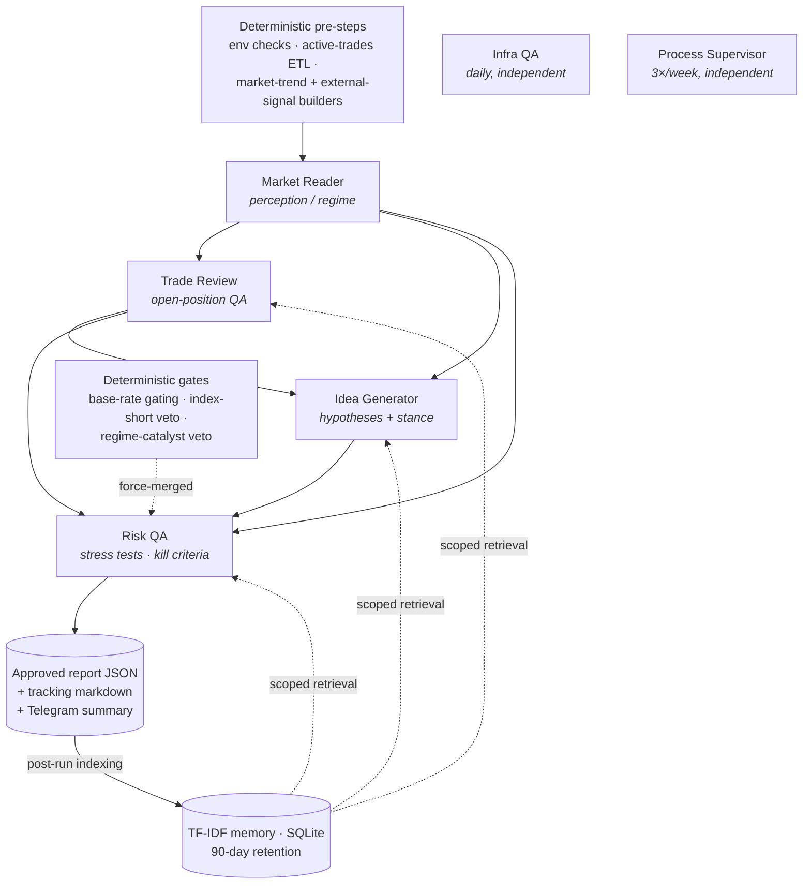

# Macro Trader

> End-to-end multi-agent pipeline for systematic trading analysis. Six agents —
> Market Reader, Trade Review, Idea Generator, Risk QA, Infra QA, Process
> Supervisor — coordinated by a DAG orchestrator with deterministic pre-step
> ETL, per-agent context budgets, and TF-IDF memory with 90-day retention.
> Runs unattended on a VPS under systemd timers.

[:material-github: Orchestration framework — public repo](https://github.com/cdavocazh/macro-trader-orchestration){ .md-button }

*The full system is a private repo (~14k LOC — Python core, bash agent
wrappers, React dashboard). The public repo above extracts the orchestration
layer — DAG runner, context-budget manager, and TF-IDF memory store — with two
runnable demos and no dependencies. Agent prompts, risk-gate thresholds, and
trading content are not included.*

---

## Problem

A disciplined trading-review process has distinct phases: read the market,
review what's already on, generate hypotheses, then stress-test them against
risk criteria. Most agent systems collapse all of that into one prompt and
lose the rigour — the model grades its own homework, and yesterday's mistakes
never feed back into today's decisions.

Macro Trader enforces the phase structure mechanically: each phase is a
separate agent with its own tool policy and context budget, hard risk gates
run *outside* the LLM, and two supervisory agents (infra health, process
review) watch the pipeline itself. The design goal is not to replace judgment
— it's to make the process run the same way on its worst day as on its best.

## Architecture



The orchestrator resolves the stage graph with a Kahn-style layered
topological sort and can run independent stages in parallel batches; with the
current dependency set the four pipeline stages resolve to a sequential
chain. Infra QA and Process Supervisor deliberately sit *outside* the DAG on
their own schedules — an auditor shouldn't share a failure domain with the
thing it audits.

Each stage is a fresh, isolated LLM session (a one-shot `claude -p` run) with:

1. A **context pack** assembled by the budget manager (below).
2. A per-agent **tool allowlist** — the perception stage is read-only
   (no Write/Edit); supervisory agents can't touch pipeline state.
3. A structured JSON output contract, written to the pipeline directory and
   consumed by downstream stages.

**Memory** is two-tier, stdlib-only: a TF-IDF cosine index over typed chunks
(regime snapshots, key levels, signals, trade verdicts, stress-test results)
in SQLite with a 90-day retention window and a time-decay multiplier
(×1.0 under 14 days, ×0.5 under 60, ×0.25 beyond), plus a 30-day rolling
history journal (JSONL) of run summaries and carry-forward notes. Retrieval
is scoped per agent — Risk QA queries past rejections and kill criteria; the
perception stage gets *no* semantic memory at all, by design, so it reads the
market fresh instead of anchoring on its own past takes.

## Design choices & tradeoffs

### Fresh isolated session per stage — not one long conversation

Each stage cold-starts against a large cached skill corpus. Consolidating the
four stages into one session was rejected twice over: sub-agent results come
back summarized (downstream stages need the *raw* JSON, not a summary), and
splitting sessions preserves prompt-cache reuse on ~1.8M tokens of shared
skills — one merged session would have raised cost an estimated 40–80%.
Tradeoff: every stage pays a cold-start, and inter-stage state must be
explicit files — which turned out to be a feature (resumability, auditability).

### Deterministic gates outrank the LLM

Base-rate gating (win-rate / expectancy thresholds), an index-short veto, and
a regime-catalyst veto run as plain Python and are **force-merged after** the
LLM's verdicts — the model cannot promote a gated idea back. A post-LLM check
even downgrades verdicts whose required base-rate reconciliation text is
missing or non-numeric. Rationale: the LLM is good at synthesis and terrible
at consistently applying hard rules under persuasive context. Tradeoff: gates
need their own maintenance and calibration cycle.

### TF-IDF memory over a vector database

For a 90-day window of highly structured daily outputs, TF-IDF cosine with an
IDF cache is sufficient, has zero external dependencies (pure stdlib + SQLite),
and is fully debuggable — you can read exactly why a chunk scored. Embeddings
would add an ops dependency and an opaque failure mode to retrieve marginally
better on a corpus this small and this structured.

### Per-agent context budgets, measured before optimized

Telemetry showed the perception stage averaging ~1.75M cache-read tokens per
run. The context manager now assembles each agent's pack by priority-ordered
greedy fill against an explicit token budget (e.g. Idea Generator: 180k across
eight sources, each with its own cap), truncating lowest-priority sources
first and logging per-source allocation. Per-run tokens and cost land in a
metrics CSV, so cost regressions are visible the day they happen.

### Failure = abort loudly, not degrade silently

Required pre-steps failing abort the run *before* any expensive model call.
A quota-exhaustion detector parses the provider's reset time and sleeps until
then rather than retry-stampeding. Every abort writes a FAILED metrics row and
sends a Telegram alert. Notifications themselves are best-effort — a missing
credential must never kill the pipeline that's trying to report on itself.

## Sample output

Each run produces a machine-readable approval report (values illustrative,
structure real):

```json
{
  "status": "COMPLETE",
  "pipeline_duration_s": 812,
  "stage_durations_s": {"market_reader": 195, "trade_review": 168,
                         "idea_generator": 244, "risk_qa": 205},
  "approved_ideas": ["..."],
  "rejected_ideas": [
    {"id": "idea-2", "verdict": "REJECT",
     "reason": "base-rate gate: setup expectancy below threshold"}
  ],
  "trade_review_summary": {"trades_reviewed": 6, "stale_trades": 1,
                            "closed_this_run": 0},
  "es_stance": "...",
  "portfolio_risk": "..."
}
```

Alongside it: a human-readable tracking review in markdown, a Telegram
summary, and a refresh of a static React dashboard (seven views — overview,
ideas, rejections, performance, regime, health) that is rebuilt from flat
JSON on each run, so the serving path needs no always-on backend.

## Stack

- **Core:** Python 3, deliberately stdlib-only (json, sqlite3, math, re,
  concurrent.futures) — no third-party runtime dependencies
- **Agents:** bash wrappers around one-shot Claude Code sessions
  (`claude -p`), per-agent model + tool policy; Claude Opus on the reasoning
  stages, Sonnet on infra checks, Haiku on scoped sub-agents
  (stress-tester, data-checker, trade-scorer)
- **Memory / state:** SQLite (TF-IDF index), JSONL (history, trade ledger),
  CSV (run + cost metrics) — flat files over a database server
- **Dashboard:** React 18 + Vite + Recharts, statically served
- **Ops:** VPS deployment under systemd timers (weekday pipeline runs, daily
  infra QA, thrice-weekly process review), Telegram alerting
- **Scale:** ~14k hand-written LOC (≈10k Python, ≈2.6k bash, ≈1.5k JSX)

## What I'd do differently

Wire retention enforcement into the run loop from day one — the semantic
memory's 90-day prune existed as a tool before it was scheduled, which is
how "designed" and "true" quietly diverge. Treat the perception stage as the
single point of failure it is: most aborted runs die there, so it deserved a
fallback data path and richer failure telemetry much earlier. And version the
agent prompts as first-class artifacts with golden-set regression — prompt
edits currently ship on trust, and the process-supervisor agent can only
critique what the pipeline records, not what the prompts silently changed.
