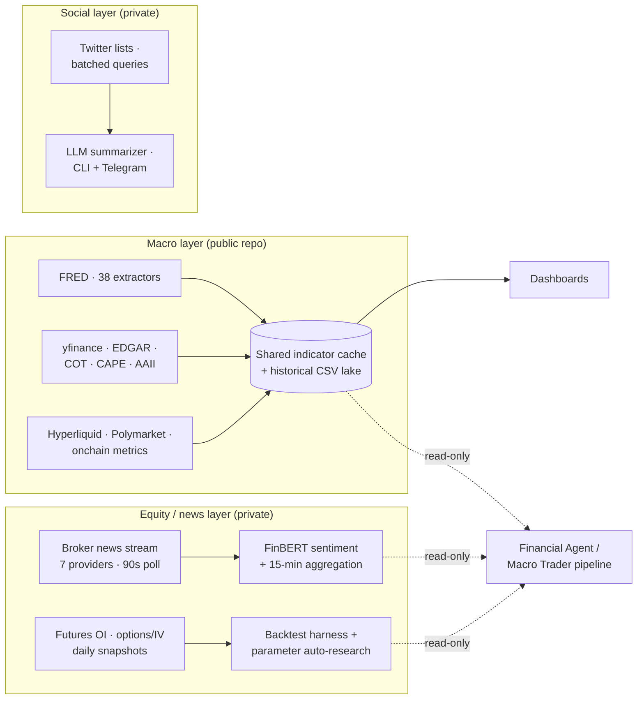

# Market Tracker

> Automated market-tracking stack: 88+ macro indicators, quarterly financials
> for ~500 US large-caps, broker news streaming with sentiment scoring,
> futures positioning, options/IV, Polymarket, Hyperliquid, Bitcoin
> positioning and onchain metrics, and Twitter-list summarization — running
> unattended across a Mac and a VPS on independent schedulers.

[:material-github: macro layer — public repo](https://github.com/cdavocazh/macro_2){ .md-button }
[:material-open-in-new: Live dashboard](http://awehawk.cloud/){ .md-button .md-button--primary }

*The macro-data layer is public. The equity/news/backtest layer and the
Twitter summarizer are private repos; their architecture is documented below.*

---

## Problem

Staying across macro, equities, crypto, and prediction markets simultaneously
is a full-time job, and most off-the-shelf dashboards cover one domain well
and the rest badly — or cost more than the edge they provide. The design
constraints here: free or already-paid sources only, unattended operation
that fails loudly rather than silently, and every downstream consumer
(analysis agents, backtests, dashboards) reading from the same cached data
rather than hitting APIs independently.

## Architecture

**Coverage.** The macro layer pulls 88+ indicators from 11 sources — FRED
(yields, credit spreads, liquidity, inflation, labor), yfinance (indices,
vol, FX, commodities), SEC EDGAR XBRL (quarterly financials for ~500 S&P
names on a shared 53-column schema, with source selection by
financial-quarter freshness rather than scrape date), CFTC COT positioning,
Shiller CAPE, AAII sentiment, Polymarket odds, Hyperliquid perps, and
Bitcoin onchain metrics. The private layer adds broker-fed news streaming
(10k+ headlines, 100% sentiment-scored), futures open-interest and
options/IV history, and a backtest engine with an automated
parameter-search harness. The social layer summarizes curated finance
Twitter lists via batched user queries with LLM summaries pushed to
Telegram.

**Coupling contract.** There is deliberately no shared database. Repos
couple through files, read-only and one-directional: consumers read the
producers' caches and are contractually forbidden (documented per repo)
from modifying upstream scripts, schemas, or timers. Every consumer can
break without taking a producer down.

**Operations.** Each extractor runs on its own cadence (1-minute for perps,
5-minute for fast market data, 5×/day for the scheduled macro batch, daily
for onchain) under launchd locally and systemd timers on the VPS, each with
a freshness guard and a hard timeout. A twice-daily QA job runs 11 health
checks over the data lake and escalates anomalies through an LLM triage
step to Telegram.

## Design choices & tradeoffs

### Free/public sources for the macro layer — which is why it could go public

Every macro-layer source is free (FRED, EDGAR, yfinance, CFTC, public
crypto endpoints). That constraint forced fallback engineering — three-tier
fallbacks for sources that throttle datacenter IPs, scrape targets that
break — but it means the entire layer is publishable and reproducible by
anyone with a free FRED key. The proprietary edge lives in what's built on
top, not in data access.

### Data localization over vendor feeds

The positioning/OI and news layers were built explicitly to replace a few
thousand dollars a year of vendor data with broker-provided and public
endpoints, snapshotted daily into local parquet/SQLite. Tradeoff: you own
backfill, gap-repair, and revision handling forever — see below for how
that bit back.

### Files and caches over a shared database

A single JSON indicator cache plus a CSV/parquet lake, no database server.
Multiple dashboard frontends and both agent systems read the same cache, so
adding a consumer costs nothing and API rate limits are paid once. Tradeoff:
no transactional guarantees — freshness guards and QA checks stand in for
what a database would give structurally.

### Fail loudly: freshness guards, timeouts, QA-with-triage

Every scheduled job checks output freshness before and after running, and a
kill-timeout bounds hangs. The failure class that motivated this was silent
zero-output: a job that exits 0 while writing nothing looks healthy in every
process-level check. The fix was checking that *data advanced*, not that
the process ran — plus the twice-daily QA sweep that reads the lake itself.

## Sample output

The public macro dashboard ([live](http://awehawk.cloud/), HTTP) covers nine
tabs: valuation, market indices, volatility & risk, macro & currency,
commodities (including COT positioning and Hyperliquid perps), large-cap
financials, rates & credit, economic activity, and Polymarket. The same
cache also feeds a Grafana deployment (111 panels) and the agent systems'
context builders.

One honest research output worth showing from the private backtest layer: an
ES strategy that scored +14.7% on the original sample **collapsed to
break-even when the data window was extended through a high-volatility
period, and 21,000+ subsequent parameter-search iterations produced zero
positive configurations**. The harness reported the negative result instead
of shipping the overfit — which is precisely what a validation harness is
for.

## Stack

| Layer | Stack |
|---|---|
| Macro (public) | Python · fredapi · yfinance · OpenBB · pandas; Plotly Dash + gunicorn (production), React + Vite + FastAPI, Grafana frontends |
| Equity / news (private) | Python 3.11 · ib_async · FinBERT (transformers) · SQLite + parquet · FastAPI + React/TS dashboard · Docker (gateway) |
| Social (private) | Python · third-party Twitter API · LLM summarization with provider fallback · Telegram bot |
| Ops | launchd (Mac) + systemd timers (VPS) · nginx · Telegram alerting |

## What I'd do differently

Backfill discipline from day one: a funding-rate annualization bug was fixed
going forward but the pre-fix rows were never backfilled, leaving a
permanent one-time step in those columns — the lesson is that a data fix
isn't done until history is reconciled or the discontinuity is annotated in
the schema. Consolidate the four dashboard frontends into one — they were a
useful bake-off (Streamlit vs Dash vs React vs Grafana) that overstayed as
four production surfaces. And promote the "output must advance" freshness
check from a per-job afterthought into the shared job wrapper, since every
silent failure found later traced back to a job that predated it.
